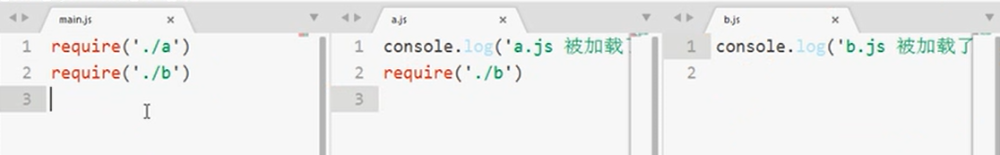

## Node 学习笔记

### 一.Node.js 介绍     

Node.js 是一个基于 Chrome V8 引擎的 JavaScript **运行时环境**

事件驱动，非阻塞I/O（异步操作），轻量高效 

提供在浏览器外解析和执行js 的能力

- 浏览器中的JavaScript
  - ECMAScript
  - DOM
  - BOM

- Node 中的Javascript
  - ECMAScript
  - 一些服务器级别的操作API
    - 文件读写，网络服务，数据库连接等

### 二.Node能做什么

- WEB 服务器后台
- 命令行工具
  - npm
  - hexo（基于node开发）
  - 。。。

### 三.下载安装和执行js

node  helloworld.js

 ###  [API文档](http://nodejs.cn/api/)

### 四.文件读取

- 浏览器的js没有**主动读取文件**的权限

  浏览器的实现方法：input:file+FileReader对象，需要用户点击表单，选择文件

  

- fs模块：file-system   提供文件读写的API

  ```js
  const fs=require('fs');//引入fs模块
  ```

- 读取文件

    读取文件的方法有很多

  ```js
  //异步读取
  //fs.readFile(path[, options], callback) 已回调的方式 异步读取文件 
  fs.readFile('hello.txt', 'utf8', (err, data) => {
      if(err)
       {
        console.log(err);
      }
       else console.log(data);
  }) //若未指定编码格式，data 为缓冲区Buffer内的一串二进制
  //同步读取
  const data=fs.readFileSync('hello.txt', 'utf8');
  console.log(data);
  ```

- 写文件

  ```js
  //flag:'a'已追加的模式进行写入
  fs.writeFile('test.txt', 'text write', { flag: 'a' }, (err) => {
      if (err)
         console.log(err);
      else console.log('文件写入成功');
  })
  
  ```

  

  

### 五.使用http 创建web服务

核心：http 模块

```js
const http=require('http');
//2.创建 server实例
const serve=http.createServer();
//3.监听request 事件，执行处理函数
/*处理函数 的参数：
*/
serve.on('request',(req,res)=>{
    // console.log(req,'接收到请求');
    console.log(req.url);//请求的路径，已 /开头
    console.log(req.headers);//请求头
	console.log(req.method);//请求方式
    res.setHeader('Content-Type', 'text/plain;charset=utf-8');//告知浏览器 用utf-8编码，解析纯文本    'text/html;charset=utf-8'):按照html 解析
    //res.write 方法给客户端发送响应 可以多次发送
   // res.write(req.url);
   // res.end();//结束响应，告知客户端停止等待
    
	 //直接使用end 发送并结束请求
     res.end('登录')
})
//4.监听端口号，启动http服务
serve.listen(8000,()=>{
    console.log('server is running at 127.0.0.1:8000');
})
```

//node 返回utf-8的编码，

### 六.Node 的模块

1. 核心模块

   服务器级别的api，fs，http，os，path

   通过require 方法 引入加载模块

2. node 的模块系统    基于     **CommonJs 规范**  实现node 自己的 模块规范

   具名的核心模块，用户模块

#### **导入**

   require的作用： **require(id) 方法**

- 加载模块并执行

- **导入模块指定的导出对象**

```js
//a.js
require('./b.js'); //执行b.js
//后缀名可省， ./不可省略
const b=require('./b')

```

#### **导出**   
在**module.exports** /**exports**对象上**挂载要导出的数据**

module.exports/exports默认为空

```js
//b.js
const name='b';
function add(a,b){
}
//导出多个 对象
module.exports={
    add,name
}
// module.exports.f = ... 可以更简洁地写成 exports.f = ...,快捷方式
exports={
    add,name
}

//导出单个对象  
exports=add;//错误方法 ！！！！！
module.exports=add;//正确

/*
原因在于模块内 默认 exports= module.exports，
对exports 赋值后 exports 失去了对 module.exports  的引用  
最后模块导出的是  module.exports 对象*/
```
#### 其他知识

- node 中，每个模块 有一个**module** 对象，

包含id，exports，parent，filename，loaded，children以及paths几个属性。

- 每个模块拥有    **文件作用域，互相隔离**

- **优先从缓存加载模块**



'b.js 被加载了' 只会 输出一次

b.js    **只会加载1次**，第二次 从**缓存 读取**

- **模块**id

  **require(id) 方法：**

  参数id:<string> 模块的   **名称或路径**

  名称：核心模块和**npm安装的的第三方 模块名称**

  *对于**npm安装的的第三方 模块名称：require('xxx')*

  - 找当前目录下node_modules/`xxx` 目录 下的**package.json**  文件

  -  package.json 的**main** 属性指向的**js文件** 指向 的是 **当前模块的入口文件**

  - 加载引入这个  **入口文件**，

    若 main为空/package.json 不存在，默认转为加载  index.js 

    若也不存在，继续向上一级文件的 node_modules 查找，

    找到盘根都没有就报错

  路径： ./ ../  开头 

### ES6 Module 模块系统 

es6 官方规范了模块系统，在script标签 添加 **type="module"** 使用模块语法


   #### 导入

通过**import** 关键字 导入模块

**只能写在js顶层 **，编译时执行

- 默认导入

  ```js
  import qs from 'qs';//适用于默认导出
  ```

- 默认导入


  ```js
   import {name,age} from 'utils.js'//
  ```

- 全部导入

```js
import * as Module from '/modules/module.mjs';//* 代表所有  ，as 重命名
//将模块内所有的可用的导出，导入到模块对象Module上，可以像使用对象一样使用，代码更简洁

const page= import('./page.vue')//作为导入函数调用，将其作为参数传递给模块的路径  适用于 页面的懒加载
```


另外 导入支持 **as** 关键字的重命名，用于解决命名空间的问题

#### 导出

通过**export** 关键字导出对象/类/变量....

- 命名导出

  ```js
  //方式1：依次单个导出
  export const name="lisi";
  export const age=20;
  
  //方式2：文件最后统一导出
  export{
  name,age
  }
  ```

- 默认导出

  ```js
  const name='777';
  export default name; // 用于主要数据的导出   只能允许出现一次默认导出
  //在引入时 可以使用任何 名字导入
  ```

  两者导出方法可以共存

### CommonJs 和 ES6 Module 的区别

- `CommonJs`导出的是变量的一份拷贝，`ES6 Module`导出的是变量的绑定（引用）

- `CommonJs`是单个值导出，`ES6 Module`可以导出多个

- `CommonJs`是动态语法可以写在判断里，`ES6 Module`**静态语法**只能写**在顶层**

   `ES6 模块编译时执行，而CommonJS模块总是在运行时加载`

- `CommonJs`的 `this` 是当前模块，`ES6 Module`的 `this` 是 `undefined`

### 在node中使用ES6 module

- 全部使用mjs后缀名

- 按照ES6标准 ，书写import 和export 代码

- 运行文件时时  添加 --experimental-modules 参数

  node --experimental-modules .\b.mjs

### 七.Content-Type

内容类型，用于定义网络传输中文件的**MIME**类型和网页的编码，决定文件接收方将以什么形式、什么编码读取这个文件

常见的媒体格式类型如下：

- text/html ： HTML格式

- text/plain ：纯文本格式   

- image/gif ：gif图片格式  

- image/jpeg ：jpg图片格式 

-   image/png：png图片格式

  以application开头的媒体格式类型：

- application/json  ： JSON数据格式

- application/pdf    ：pdf格式 

- application/javascript ：js文件

- application/msword ： Word文档格式

- application/octet-stream ： 二进制流数据（如常见的文件下载）

-   application/x-www-form-urlencoded ： <form encType="">中默认的encType，form表单数据被编码为key/value格式发送到服务器（表单**默认的提交数据的格式**）

  另外一种常见的媒体格式是上传文件之时使用的：

-   multipart/form-data ： 需要在表单中进行**文件上传时，就需要指定使用该格式**

### 小练习：一个静态资源API

- response.writeHead(statusCode[, statusMessage][, headers]) 方法

向请求发送响应头。 状态码是一个 3 位的 HTTP 状态码，如 `404`。 最后一个参数 `headers` 是响应头。 可以可选地将用户可读的 `statusMessage` 作为第二个参数

返回对 `ServerResponse` 的引用，以便可以链式调用

```js
 res.writeHead(404, {
                    'Content-Type': 'text/html;charset=utf-8'
                }).end('<h1>404 not found</h1>')
```

#### 补充知识点   http模块 

1. 获取GET请求的参数

   get请求的参数是直接通过url表达的

```js
const URL = require('url');//引入url用于解析url
const querystring = require('querystring');//引入querystring 用于解析query字符串，分隔?和&，转化为一个参数对象
//.....省略代码

serve.on('request', (req, res) => {
    const url = URL.parse(req.url);//解析url，构建URL对象，
    const pathname=url.pathname;
    const query = querystring.parse(url.query);//解析 query 得到路径里的每个参数,返回一个参数对象
    
})

```

2. 获取POST请求的参数

   POST 请求的内容全部的都在请求体中，http.ServerRequest 并没有一个属性内容为请求体，原因是等待请求体传输可能是一件耗时的工作。所以 node.js 默认是不会解析请求体的，当你需要的时候，**需要手动来做。**

```js
const querystring = require('querystring');
const util = require('util');

let postParams='';
        //通过req的data事件监听函数，每当接受到请求体的数据，就累加到post变量中
        req.on('data',chunk=>{
            postParams+=chunk;
        });
        // 在end事件触发后，通过querystring.parse将post解析为真正的POST请求格式
        req.on('end',()=>{
            postParams=querystring.parse(postParams);//解析为对象
            console.log(postParams);
            res.end(util.inspect(postParams));//转换为字符串
        })
```

### 八.评论页面 feedback

1. 读取目录

   ```js
   fs.readdir('./',(err,files)=>{//files：文件名、目录数组
       
   })
   ```

   模板html 文读取之后就是字符串，可直接更改

2. Node 中使用html 模板引擎 ///服务器渲染 

   **art-template 引擎**，提供模板语法  {{name}}插值语法，类似于Vue 模板语法

   模板引擎最开始就是诞生于服务器，后来才发展到前端

```js
const templateEngine =require('art-template');

//templateEngine.render('模板字符串',替换对象)
const template=`<!DOCTYPE html>
<html lang="en">
<head>
    <meta charset="UTF-8">
    <meta name="viewport" content="width=device-width, initial-scale=1.0">
    <title>Document</title>
</head>
<body>
       <p>大家好。我叫{{name}}</p>
       <p>我今年{{age}}岁</p>
       <p>我喜欢{{like}}</p>
</body>
</html>`

const result=templateEngine.render(template,{
    name:'JACK',
    age:'20',
    like:'codeing'
})

console.log(result);
```


3. **服务端渲染和客户端渲染**

- 客户端渲染

  客户端发起请求，服务端把页面（响应的是字符串）发送过去，客户端从上到下依次解析，如果在解析的过程中，发现ajax

  请求，再次像服务器发送新的请求，客户端拿到ajax 响应数据，模板引擎渲染。至少两次请求

  - 缺点： 对SEO相当不友好

  - 优点： 减轻了服务器端的渲染压力;同时，最大的好处就是：能够实现前后端分离开发;

- 服务端渲染

  服务端过程：1.读取index.html  2.模版进行渲染，在发送给客户端之前，在服务端已经把**index.html 渲染处理好了**才发给客户端，客户端浏览器直接渲染html文件，不需要多余的请求

  - 优点：对SEO友好，因为我们经过服务器端渲染的页面，在网络中传输的时候，传输的是一个**真实的页面。**因此，爬虫客户端，当爬到我们的页面后，

  会分析我们给他提供的这个页面，此时，我们页面中的关键数据就会被爬虫给收录了。

  - 缺点： 服务器端渲染，对服务器压力比较打，可以使用服务器端的页面缓存技术，减轻服务器的渲染压力；不适合前后端分离开发。

**最重要的区别就是究竟是谁来完成html文件的完整拼接**

很多网站是两者相结合

4. html 模板的里的 src/href 等，**应该使用 url** ，不该使用相对路径

 浏览器收到 HTML 响应内容之后，就要开始从**上到下依次解析**，
    当在解析的过程中，如果发现：
      link
      script
      img
      iframe
      video
      audio
    等带有 s**rc 或者 href（link） 属性标签（具有外链的资源）的时候，浏览器会自动对这些资源发起新的请求**。

   

5. form 标签，提交表单请求

表单中需要提交的表单控件元素必须具有 name 属性,就是请求时的参数名称
      表单提交分为：

        1. 默认的提交行为
                2. 表单异步提交
              **action** 指定表单提交的请求url
                method 请求方法get/post
                
                enctype:规定 content——type MIME类型
                默认：application/x-www-form-urlencoded 
                当需要上传文件时 需要改为   multipart/form-data 
2. url模块   获取GET参数  ,post 请求

   

3. 重定向

   301：永久重定向

   302：暂时重定向

   ```js
    res.writeHead(302, {
                           'Location': '/'
                       }).end();
   //重定向到 / 根
   ```

   

### 九.package.json

1. 包说明文件，描述当前**项目的信息**    通过   npm init -y  创建（-y ： yes ,省去了默认选项点击）

字段：

- **dependencies**  **运行时依赖**/**生产阶段的依赖**

npm install xxx **--save** 会把依赖记录在 **dependencies** 字段下，记录当前 项目的**运行时依赖**

- **devDependencies**    **开发时依赖**

  

- scripts  :npm命令行指令
- ......
- 

通过 **npm install**  安装回所有依赖

2. package-lock.json 文件

   会在npm更改node_modules目录树或者package.json时自动生成的，**它准确的描述了当前项目npm包的依赖树，**并且在**随后的安装中会根据package-lock.json来安装**，保证是相同的一个依赖树，速度更快

   - **描述了当前项目npm包的依赖树**
   - 锁定依赖版本 -lock

### 十.npm

- npm网站
- 包管理工具 ,一个命令行工具

npm -v 查看版本

- 常用命令

  - npm init

     npm init -y 

  - npm install

    按照 **dependencies**     **devDependencies**    所有依赖

    简写：npm i
    
  - npm install xxx
  
    npm i xxx
  
  - **npm install xxx --save** 
  
    下载并保存到package.json 文件的 **dependencies**     
  
    npm i xxx -S
    
  - **npm install xxx --save -dev**
  
    下载并保存到package.json 文件的 **devDependencies**    
  
    npm i xxx -D
    
  - npm uninstall  xxx
  
     删除模块，但保存依赖
  
     npm un xxx
  
  - **npm uninstall xxx --save**
  
     删除模块，同时删除依赖
  
     **npm un xxx -S**
  
  - **npm uninstall xxx --save -dev**
  
     **npm un xxx -D**
  
  - npm install xxx -gloabl
  
     全局按照 xxx
  
      npm i xxx -g
  
  - npm ls 
  
     查看安装的模块
  
  - npm 命令 --help
  
     查看命令帮助
  
  - ......
  
  - npm config 
  
     配置npm
  
  - npm config list 
  
     列出 配置
  
  - npm list --depth=0 -global
  
     获取全局安装的模块

- 使用cnpm

  使用 淘宝镜像 npm.taobao.org

  npm i  cnpm -g    //全局按照cnpm

  **cnpm i xxx --save** 


### 十一.Express

**Web 开发框架**    提高开发的效率

express，koa 等

#### 基本使用

- 安装，起步

```js
const express = require('express');
//创建 app  
const app=express();

//静态资源 服务,使用 express.static 中间件
//匹配 url中 的/resource 到 当前./resource 下的文件
app.use('/resource',express.static('./resource'))

//匹配请求路径 === 路由
app.get('/',(req,res)=>{
    res.send('<h1>hello</h1>');
    
})
//监听端口
app.listen(8080,()=>{
    console.log('running ');
})
```

- 静态资源 服务

  app.use 添加 express 自带的中间件express.static 

  ```js
  //匹配 url中 的/resource 到 当前./resource 下的文件
  app.use('/resource',express.static('./resource'));//通过/resource/main.js访问
  app.use(express.static('./resource'));//通过/main.js访问 
  ```

  **使用这种方法可以快速搭建静态网站**

- 基本请求路由 router

  匹配请求路径，映射关系，路由表

  - app.get(’'/'')

  - app.post('/')

    

- 获取get 请求参数

  req.query  一个处理好的参数对象

- 获取post 请求参数

  - 使用express 自带的**中间件** 解析post 参数

    使用以下中间件，填充req.body (req.body 默认为空)
  
    ```js
    app.use(express.json()); // for parsing application/json
    app.use(express.urlencoded({ extended: true })); // for parsing application/x-www-form-urlencoded
    ```
  
  - 第三方中间件 **body-parser**
  
    ```js
  var bodyParser = require('body-parser')
    // parse application/x-www-form-urlencoded
    app.use(bodyParser.urlencoded({ extended: false }))
    
    // parse application/json
    app.use(bodyParser.json())
    ```
    
    
    
    
  
#### express 中使用art-template 模板引擎

[官方文档 ：](https://aui.github.io/art-template/express/)

- 安装

  ```bash
  npm install --save art-template
  npm install --save express-art-template
  ```

  

- 使用

  - app.engine 方法安装 模板引擎

  - res.render（**view** [，locals] [，callback]）

    view:文件路径。这可以是绝对路径，也可以是相对于`views文件夹`的路径

  ```js
  app.engine('art', require('express-art-template'));//使用express-art-template 渲染.art文件
  // routes
  app.set('views', path.join(__dirname, 'views'));//设置 渲染文件的 默认路径
  app.get('/', function (req, res) {
      res.render('index.art', {
          user: {
              name: 'aui',
              tags: ['art', 'template', 'nodejs']
          }
      });
  });
  ```


#### 处理404

```js
//在最后添加 一个中间件
// 如果没有一个路由 能够匹配 就返回404
app.use( (req, res, next)=> {
    res.render('404.html')
  })
```


### .Node 中的中间件

在NodeJS中，中间件主要是指封装 了对 Http请求 细节的处理  **方法，函数**

用来简化和隔离**基础设施与业务逻辑之间的细节**，让开发者能够关注在业务的开发上，以达到提升开发效率的目的。

1. app.use（[path，] **callback** [，callback ...]）

   将指定的一个或多个[中间件](https://www.expressjs.com.cn/guide/using-middleware.html)函数**安装在指定的路径**上：当所**请求路径与 path匹配 **时，将执行中间件函数

   - path  **默认'/'**
   - callback 回调函数；可：
     - 中间件功能。
     - 一系列中间件功能（以逗号分隔）。
     - 一系列中间件功能。

2. express 内置中间件

   - express.json（[选项]）

     这是Express中的内置中间件功能。它使用[body解析器](https://www.expressjs.com.cn/en/resources/middleware/body-parser.html)解析带有JSON负载的传入请求 。

   - express.urlencoded（[选项]） 

     使用urlencode的有效载荷解析传入的请求，并且基于body-parser

   - 

3. 第三方中间件


### 十三.使用nodemon 监控文件变化并重新运行

nodemon 可以用来监控代码变化自动重启服务器

安装

```bash
# 全局安装
npm install -g nodemon
# 或者开发时依赖
npm install --save-dev nodemon
```

使用

```bash
nodemon app.js
```


### 十四.CRUD  json模拟

#### 1.路由设计

| 请求方法 | url                    | get参数 | post参数                   | 返回值   | 备注             |
| -------- | ---------------------- | ------- | -------------------------- | -------- | ---------------- |
| GET      | /student               |         |                            | html     | 首页             |
| GET      | /student/info?id=xxx   | id      |                            | 学生信息 | 获取学生信息     |
| POST     | /student/new           |         | name,age,gender,hobbies    | 学生信息 | 添加学生         |
| GET      | /student/new           |         |                            |          | 渲染添加学生页面 |
| GET      | /student/edit          |         |                            |          | 渲染编辑学生页面 |
| POST     | /student/edit          |         | id,name,age,gender,hobbies | 学生信息 | 编辑学生         |
| GET      | /student/delete?id=xxx | id      |                            |          | 删除学生         |
|          |                        |         |                            |          |                  |

#### 2.封装路由

**封装路由逻辑到单独的文件模块，** **模块化**开发

使用**express.Router()**中间件  ，可以将 路由按照url 封装到 不同文件， 用于**特定的根URL**，模块**职责更加单一**，

```js
//router.js文件
const express=require('express');
//创建路由容器
const router=express.Router();
//挂载路由
router.get('/',(req,res)=>{})

//app.js文件
const router=require('./router.js')
...
//把路由容器挂载到app 上
app.use(router);
```

#### 3.封装操作API

#### 4.渲染编辑页面

```html
<!--type="hidden" 类型的input ，不显示，但随着 表单提交-->
<input type="hidden" name="id" value="{{student.id}}">

```


###  Node 当中的 ./ 

- `__dirname `始终是当前**正在执行的脚本**所在的目录路径

- 当您使用`path`和`fs`等库时  :  **.**     表示终端窗口（即**工作目录**）中运行`node`命令的**js文件所在目录**    与 process.cwd()  一致
- 执行  require()，.  表示执行require （） 当前所在的 js 文件


### 十五.MongoDB   

MongoDB 是 介于  关系数据库和非关系数据库之间 ，关系数据库和非关系数据库之间的产品，是非关系数据库当中功能最丰富，最像关系数据库的。

NoSql :not only sql  **非关系型 数据库**

关系型数据库：

- 表 存储关系
- 通过结构化查询语言（SQL）
- 提前设计表结构
- 约束

非关系型：

- 没有声明性查询语言(不使用SQL语句)

- 没有预定义的模式，表结构，灵活
- 


mongoDB是 一种文档 存储，数据存储为一个文档，数据结构由键值(key=>value)对组成，BSON（一种类似于Json）