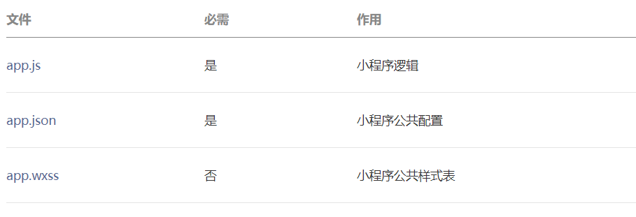
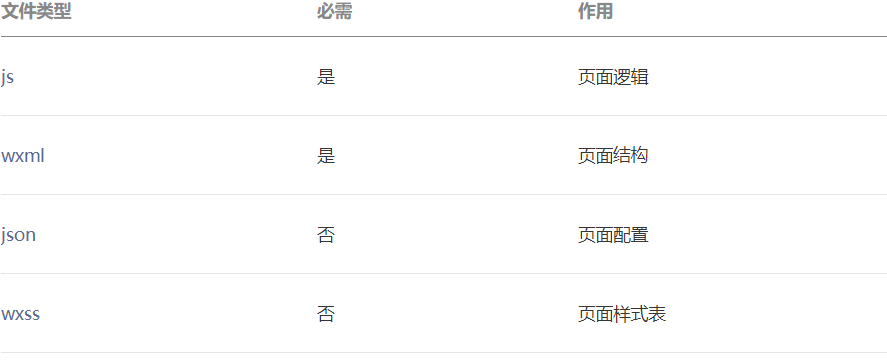
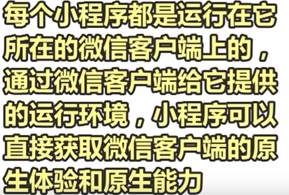
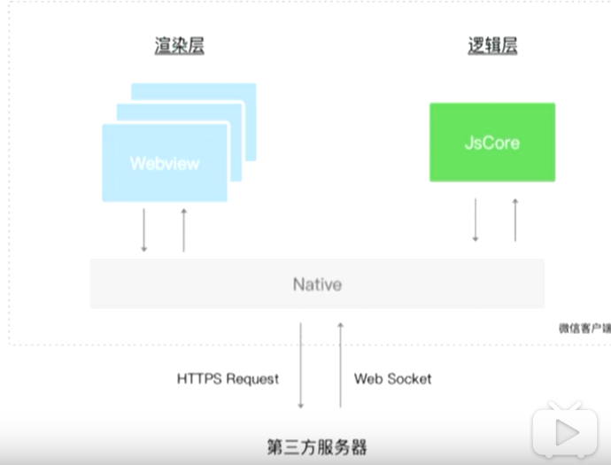
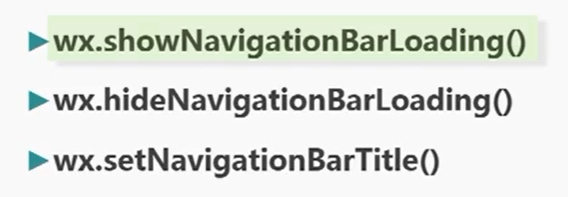
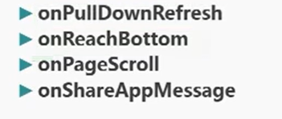

## 本笔记主要记录学习微信小程序原生（wxml，wxss ）

--- 本笔记旨在了解学习下原生

**学后总结：**

- **小程序并没有DOM的概念**，没有给开发人员提供原生的操作也页面的方法，只能通过渲染层和逻辑层的数据绑定来实现，这给开发带来一定的局限性，

- 类MVVM框架的语法

  小程序使用了类Vue（或者说MVVM框架）的语法，很多地方相似，却又有很大不同，很多地方并没有Vue好用，例如，事件处理（参数传递方面），数据绑定，组件和页面之间的关系等，相比与Vue，小程序的很多地方显得很麻烦

- 运行环境和传统web的差异

  在实际的开发过程中，我发现对于wxml和wxss，传统web的很多属性并不具备，像伪类和伪元素选择器，并不能很好的支持

### 一.设计规范

1.  友好：重点突出  、流程清楚

2. 清晰：导航明确、减少等待、**异常可控/反馈**  

3. 便捷：减少输入、避免误操作、操作流畅

4. 统一：视觉统一

### 二.目录结构   

小程序包含一个描述整体程序的 `app` 和多个描述各自页面的 `page`。

- 一个小程序主体部分由三个文件组成，必须放在项目的根目录，如下：



- 一个小程序页面由四个文件组成，分别是：



- 小程序配置

  1. app.json 配置文件

     必须配置 pages 属性：表示页面路径的列表 

     每个页面的json 文件不能为空

  2. 某个页面.js

     每个页面的 js文件 要用 Page（{}）注册页面

     

### 三.View，text，image 组件

text ：容纳文本，只能容纳纯文本，其他组件会被忽略

iamge

View：类型div 的容器元素

**知识点：** 

- wxml中 元素和组件概念一致

- wxml 中所有的元素都是闭合的，没有自闭和的组件

### 四.navigator 组件 导航页面 

类似于a标签

**url 属性**指向的外部链接或内部页面路径

**open-type 属性**：修饰 链接的跳转行为（默认navigator，可返回）

设置为redirect 将不能返回，重定向路由

<span style="color:red">hover-class 属性</span>： 指定触摸按住的类名，

生效原理就是<span style="color:red">覆盖 原有的class</span> ，注意css权重问题

**注意事项**

默认是行级元素

### 五.配置tabBar (全局底部标签栏)

在全局配置文件app.json

tabBar下的l**ist 属性**（一个对象数组）

```json
"tabBar": {
    "list": [
      {
        "text": "每周推荐",
        "pagePath": "pages/weekly/weekly",
        "iconPath": "assets/images/home.png",
        "selectedIconPath": "assets/images/home_active.png"
      },
      {
        "text": "关于",
        "pagePath": "pages/about/about",
        "iconPath": "assets/images/about.png",
        "selectedIconPath": "assets/images/about_active.png"
      }
    ]
  }
```


如果使用tabBar ，那么navigator 的**open-type** 属性就要改为 **switchTab**

表示完成两个动作：

1. 路径和页面的切换
2. 底部tabBar 的切换

### 六.全局导航栏的配置

app.json 中配置

window 属性 全局窗口属性

```json
"window": {
    "navigationBarTextStyle": "black",
    "navigationBarBackgroundColor": "#fff",
    "navigationBarTitleText": "校园猫猫图鉴"//页面的默认导航栏 文字
  },

```


### 七.数据绑定  

类似于Vue（MVVM）

在Page()注册页面传入的参数对象中

data 上声明，

<span style="color:red">在wxml 中所有的 引用 必须使用，包括指令mustache 语法（{{name}}）进行引用,</span>


### 8.小程序的运行环境和基本架构


- 运行环境

  

- 基本架构：视图层和逻辑层



wxml+wxss:渲染层 view

js：逻辑层 model

页面的webviewId属性记录页面所在的渲染层进程id

### 八.条件渲染

wx:if="{{isshow}}" 

```html
<text wx:if="{{isRecommend}}">强烈推荐</text>
<text hidden="{{isRecommend}}">强烈推荐</text>
```

**注意使用插值语法**

hidden 和wx:if 区别 和v-if和v-show 的区别一致

### 九.列表渲染

wx:for="{{}}" 

内置规定的item，index 变量，表示当前的数组项和下标

### 十.swiper 组件

swiper 组件的属性：

indicator-dots 属性：表示是否显示指示器

previous-margin：设置前一个 item露出宽度，

next-margin :设置后一个item 露出宽度

配合子元素，swiper-item

设置swiper 的大小

### 十一.声明周期函数

<span style="color:red">不能在声明 data 上的状态时，引用 data 对象上的其他变量</span> ,必须在页面的某个**生命周期**中对它赋值，（和Vue的区别在此）

在onLoad 函数中 使用**this.setData** 对data 上的状态赋值

- **生命周期函数：** onLoad(query)

| [onLoad](https://developers.weixin.qq.com/miniprogram/dev/reference/api/Page.html#onLoad-Object-query) | function | 参数                               |      | 生命周期回调—监听页面加载                                    |
| ------------------------------------------------------------ | -------- | ---------------------------------- | ---- | ------------------------------------------------------------ |
| [onShow](https://developers.weixin.qq.com/miniprogram/dev/reference/api/Page.html#onShow) | function | **query:打开当前页面路径中的参数** |      | 生命周期回调—监听页面显示                                    |
| [onReady](https://developers.weixin.qq.com/miniprogram/dev/reference/api/Page.html#onReady) | function |                                    |      | 生命周期回调—监听页面初次渲染完成， **可以开始交互**         |
| [onHide](https://developers.weixin.qq.com/miniprogram/dev/reference/api/Page.html#onHide) | function |                                    |      | 生命周期回调—监听页面隐藏，**路由切换**                      |
| [onUnload](https://developers.weixin.qq.com/miniprogram/dev/reference/api/Page.html#onUnload) | function |                                    |      | 生命周期回调—监听页面卸载，**路由重定向，原页面会被关闭写在** |

一个页面加载的 触发顺序：   onLoad->onShow->onReady

通过this.data.xxx使用状态

- **使用setData 函数** 对状态更新，新增状态

Page.prototype.setData(Object data, Function callback)

Object 以 key: value 的形式表示，**将 this.data 中的 key 对应的值改变成 value**

`setData` 函数用于将数据从逻辑层发送到视图层（异步），同时改变对应的 `this.data` 的值（同步）

<span style="color:red">同步的更新视图层和逻辑层，只能用setData 方法对状态进行</span>

**直接修改 this.data 而不调用 this.setData 是无法改变页面的状态的，还会造成数据不一致**

 1.局部更新状态 ：array[2].message，a.b.c.d

2.新增状态

小程序中视图层的绑定的数据更新不会反应到逻辑层的状态，**即数据绑定默认是单向的**

### 十二：事件机制

1. bindEventName  和catchEventName=“fun”  绑定

   **区别:**

   catchxxx 绑*定的事件不会向上冒泡，*而bindxxx 绑定的事件会正常冒泡

2. event对象

   属性

   type:事件类型

   currentTarget:事件处理函数的所在的元素

   **target:真正触发事件的元素**

   touches：包含事件触发的 位置信息

   

### 十三：dataset

1. 编程式的页面 跳转

   wx.navigateTo(Obj) /redirectTo(obj)/switchTab({obj)

2. 路径参数

   - 传递：detail?id=77  包裹在url，进行query传递

     ```js
     `/pages/detail/detail?id=77`
     ```

     

   - 获取：生命周期函数的**参数获取**

     ``` js
     onLoad(query)
     {
         
     }
     ```

     

3. **dataset** 组件的自定义属性 **用于给事件处理函数的参数传递**

组件上 :data-xxx (驼峰)的属性；事件触发时存储到组件的dataset 属性上，

获取事件对象event.currentTarget,属性

```html
	<text data-movie-id="{{item.id}}" bindtap="goDetail" class="go-detail">查看电影详情</text>
```

```js
goDetail(event) {
    const id = event.currentTarget.dataset.movieId;
    wx.navigateTo({
      url: `/pages/detail/detail?id=${id}`,//包裹在url，进行query传递
    });
  },
```

### 十四：API请求

```js
wx.request({
  url: 'test.php', //仅为示例，并非真实的接口地址
  data: {//携带参数
    x: '',
    y: ''
  },
  header: {
    'content-type': 'application/json' // 默认值
  },
  success (res) {//无论状态码是什么，都会调用success
    console.log(res.data)
  }
})
```

### 十五: 动态 设置导航栏loading和标题



### 十六：页面事件处理哈桑农户和自定义页面转发

- 页面事件处理函数

  

  

下拉刷新

上划触底

滑动

分享，转发事件

- 分享

```js
 onShareAppMessage(){
    return {
      title:'电影'+this.data.movieData.name
    }
  }
```

### 十七：组件化开发

高内聚+可复用

1. 构成和结构

   json，wxml，wxss，js 文件

   - 组件本身json 配置文件的 **component**属性为true

   - 需要在用到这个组件的page的**usingComponents** 属性声明组件及其路径

     

2. component构造函数

   ```js
   Component({
   
     behaviors: [],
   
     properties: {// 对外属性名，类似于prop
       myProperty: { 
         type: String,
         value: ''
       },
       myProperty2: String // 简化的定义方式
     },
     
     data: {}, // 私有数据，可用于模板渲染
     // 生命周期函数，可以为函数，或一个在methods段中定义的方法名
     created：function () { }, //组件被创建
     attached: function () { }, //组件被挂载到页面dom
     ready: function() { },
     detached: function () { },//组件从页面dom移除
   
   
     methods: {
       onMyButtonTap: function(){
         this.setData({
           // 更新属性和数据的方法与更新页面数据的方法类似
         })
       },
       // 内部方法建议以下划线开头
       _myPrivateMethod: function(){
         // 这里将 data.A[0].B 设为 'myPrivateData'
         this.setData({
           'A[0].B': 'myPrivateData'
         })
       },
       _propertyChange: function(newVal, oldVal) {
   
       },
         test(){
              this.triggerEvent('itemremove'，myEventDetail,);//传递自定义事件
         }
        
     }
   
   })
   使用 C
   ```

   